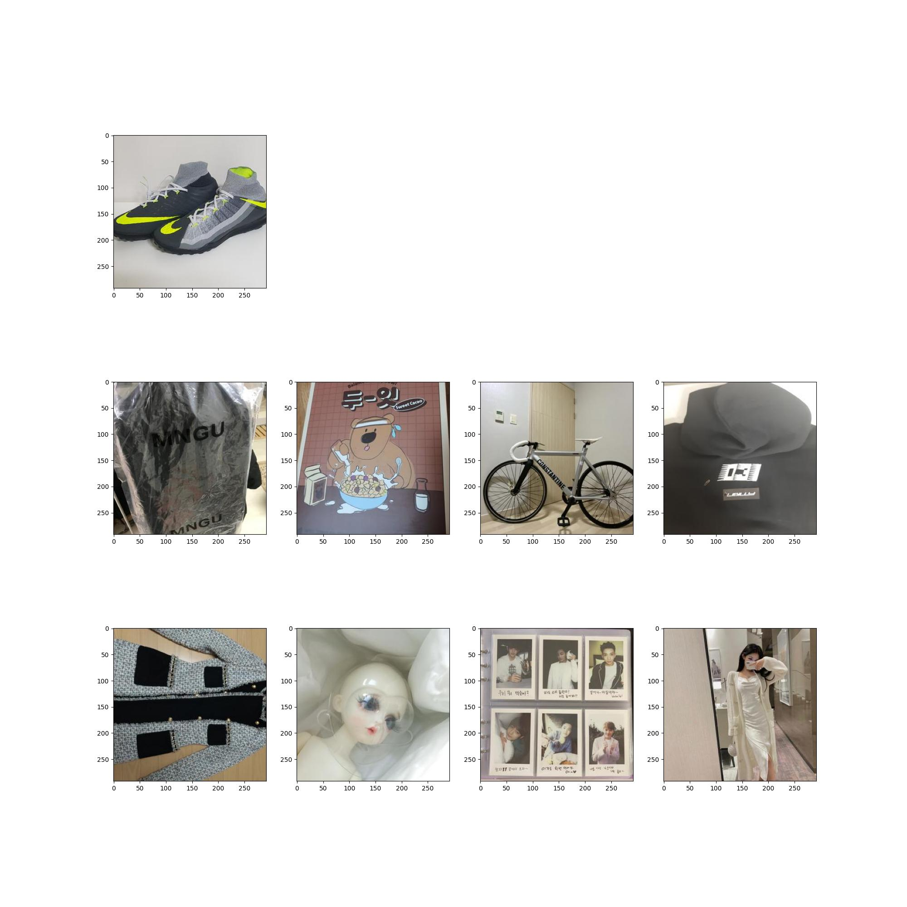

# item-based collaborative filtering

## **프로젝트 개요**
- 특정 상품에 대해서 그 상품과 연관 있는 상품들을 제공하는 상품-to-상품 추천
- 클릭 로그 데이터를 활용한 Collaborative Filtering 방식

## **활용 라이브러리**
- [sklearn.neighbors.NearestNeighbors](https://scikit-learn.org/stable/modules/generated/sklearn.neighbors.NearestNeighbors.html)
---
## **How to use**
1. 데이터 다운로드
- 데이터 다운로드 후, data/ 폴더 하위에 위치 

2. 환경 내 requirements 패키지 설치
```
pip install -r requirements.txt
```
3. 데이터 전처리
```
python data_preprocessing.py
```
4. 학습 및 결과 이미지 생성
```
python run.py
```

---
## **시각화 예시**



